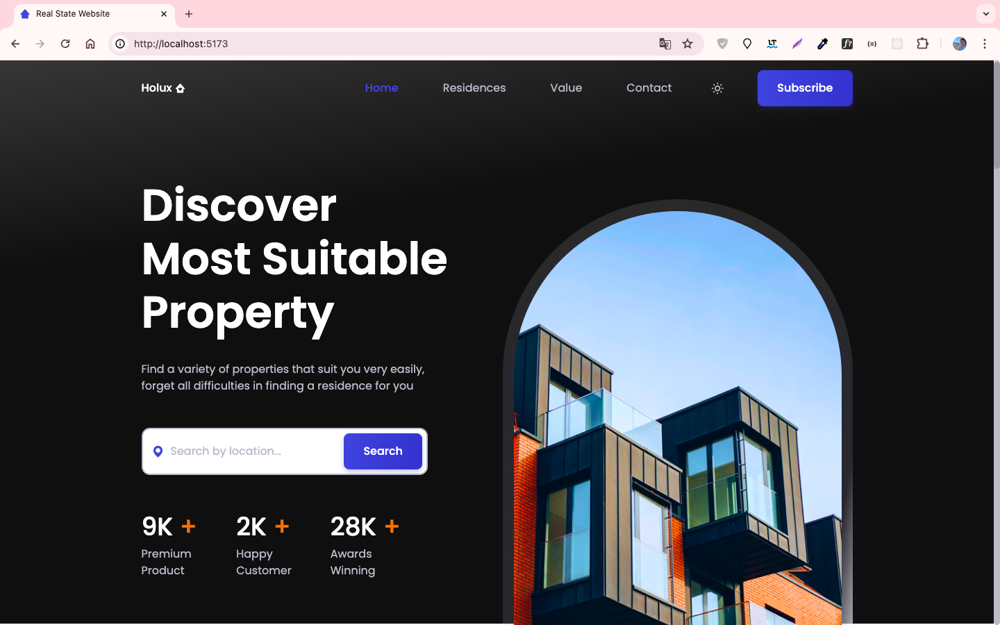
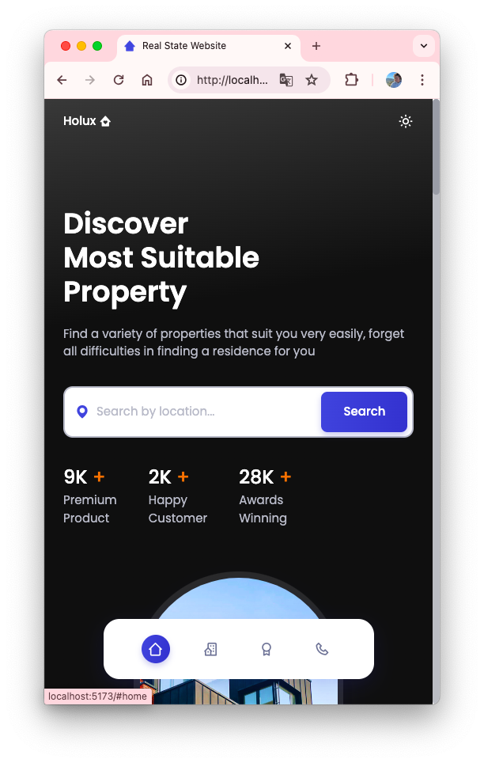
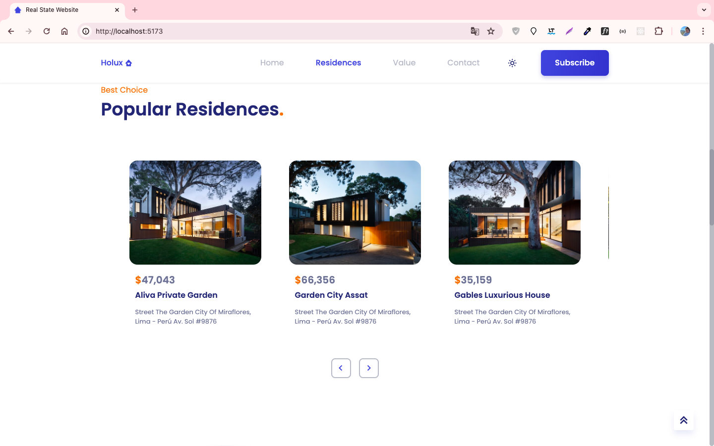
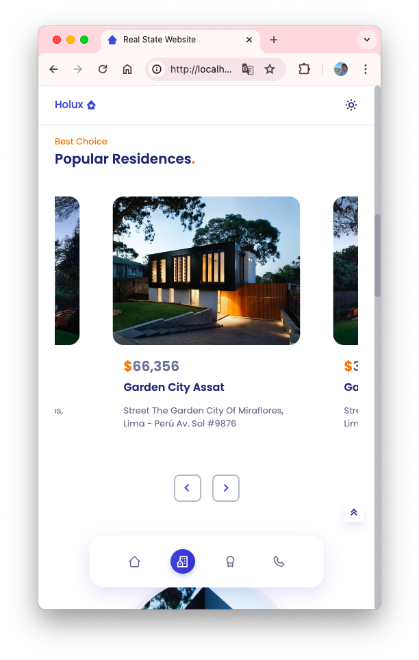

# Real State website

This is a solution to the [Responsive Real Estate Website project](https://youtu.be/twRLgPsP1H0?si=eu02akj7nacKP3qX) on YouTube. The original project was developed using HTML, CSS, and JavaScript. This remake uses Vue, TypeScript and Tailwind CSS to enhance the functionality and design.

## Table of contents

- [Overview](#overview)
  - [The challenge](#the-challenge)
  - [Screenshot](#screenshot)
  - [Links](#links)
- [My process](#my-process)
  - [Built with](#built-with)
  - [What I learned](#what-i-learned)
  - [Useful resources](#useful-resources)
- [Author](#author)

## Overview

### The challenge

Key Features:

- Contains animations when scrolling.
- Includes both dark and light modes.
- Smooth scrolling for each section.
- Developed with a Mobile First methodology, then optimized for desktop.
- Compatible with all mobile devices, offering a beautiful and pleasant user interface.
- This project showcases the ability to create responsive and dynamic web applications using - modern frameworks and tools.

### Screenshot






### Links

- Live Site URL: https://sue-real-state-website-vue-ts.netlify.app/

## My process

### Built with

- Semantic HTML5 markup
- CSS custom properties
- Flexbox
- CSS Grid
- Mobile-first workflow
- TypeScript
- [Vue](https://vuejs.org/)
- [TailwindCSS](https://tailwindcss.com/) - CSS framework

### What I learned

In the process of working on this project, I've gained valuable insights and learned various skills:

1. Vue Component Structure: Through building this project, I deepened my understanding of organizing and structuring Vue components effectively, ensuring modularity and reusability.

2. Custom Tailwind Classes: I extensively utilized Tailwind CSS to create custom styles and layouts, mastering the art of crafting unique designs by combining Tailwind utility classes.

```js
theme: {
    extend: {
      colors: {
        "first-color": "hsl(228, 66%, 53%)",
        "first-color-alt": "hsl(228, 66%, 47%)",
        "first-color-light": "hsl(228, 62%, 59%)",
        "first-color-lighten": "hsl(228, 100%, 97%)",
        "first-color-dark": "hsl(228, 66%, 62%)",
        "second-color": "hsl(25, 83%, 53%)",
        "second-color-dark": "hsl(25, 57%, 54%)",
        "title-color": "hsl(228, 57%, 28%)",
        "text-color": "hsl(228, 15%, 50%)",
        "text-color-light": "hsl(228, 12%, 75%)",
        "text-color-dark": "hsl(228, 8%, 70%)",
        "title-color-dark": "hsl(228, 8%, 95%)",
        "border-color": "hsl(228, 99%, 98%)",
        "border-color-dark": "hsl(228, 16%, 14%)",
        "body-color": "#fff",
        "body-color-dark": "hsl(228, 12%, 8%)",
        "container-color": "#fff",
        "container-color-dark": "hsl(228, 16%, 12%)",
      },
      fontFamily: {
        body: ["Poppins", "sans-serif"],
      },
      fontSize: {
        "biggest-font-size": "2.25rem",
        "biggest-font-size-large": "4rem",
        "h1-font-size": "1.5rem",
        "h1-font-size-large": "2.25rem",
        "h2-font-size": "1.25rem",
        "h2-font-size-large": "1.5rem",
        "h3-font-size": "1rem",
        "h3-font-size-large": "1.25rem",
        "normal-font-size": "0.938rem",
        "normal-font-size-large": "1rem",
        "small-font-size": "0.813rem",
        "small-font-size-large": "0.875rem",
        "smaller-font-size": "0.75rem",
        "smaller-font-size-large": "0.813rem",
      },
      fontWeight: {
        "font-medium": "500",
        "font-semi-bold": "600",
      },
      zIndex: {
        "z-tooltip": "10",
        "z-fixed": "100",
      },
      height: {
        "header-height": "3.5rem",
      },
    },
  },
```

3. Dark/Light Theme Switching with Tailwind: Implementing the feature of toggling between dark and light themes using Tailwind utilities taught me how to dynamically modify styles based on user preferences, enhancing user experience.

```js
darkMode: "class",
```

```css
body {
  @apply bg-body-color dark:bg-body-color-dark text-text-color dark:text-text-color-dark;
}
```

```html
<i class="text-xl text-first-color dark:text-first-color-dark bx bxs-map"></i>
```

4. Page Load Animation: I explored techniques for animating elements upon page load, improving the visual appeal and engagement of the website.

```js
const sr = ScrollReveal({
  origin: "top",
  distance: "60px",
  duration: 2500,
  delay: 400,
});

sr.reveal(".home__title");
```

5. Innovative Mobile Nav Design: Designing a distinctive mobile navigation layout that blurs the boundary between web and mobile applications pushed me to think creatively and experiment with unconventional UI/UX solutions. You can see that at HeaderComponent.vue

### Useful resources

- [Icons](https://boxicons.com/)
- [Fonts](https://fonts.google.com/)
- [GitHub cheatcodes](https://github.com/bedimcode/responsive-watches-website/blob/main/assets/js/main.js)
- [Swiper](https://swiperjs.com/)
- [ScrollReveal](https://scrollrevealjs.org/)
- [Tailwind cheat sheet](https://nerdcave.com/tailwind-cheat-sheet)
- [Tailwind dark mode](https://tailwindcss.com/docs/dark-mode)

## Author

- X - [@suereact](https://www.x.com/suereact)
